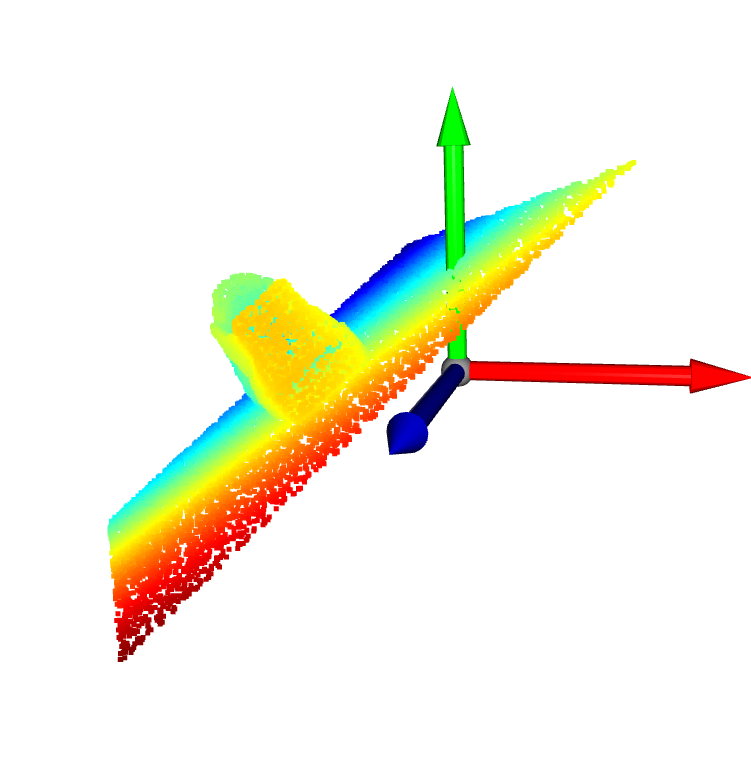
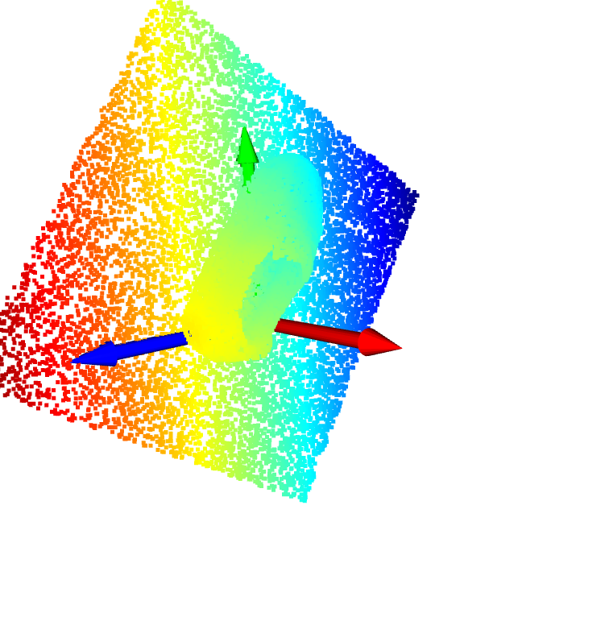
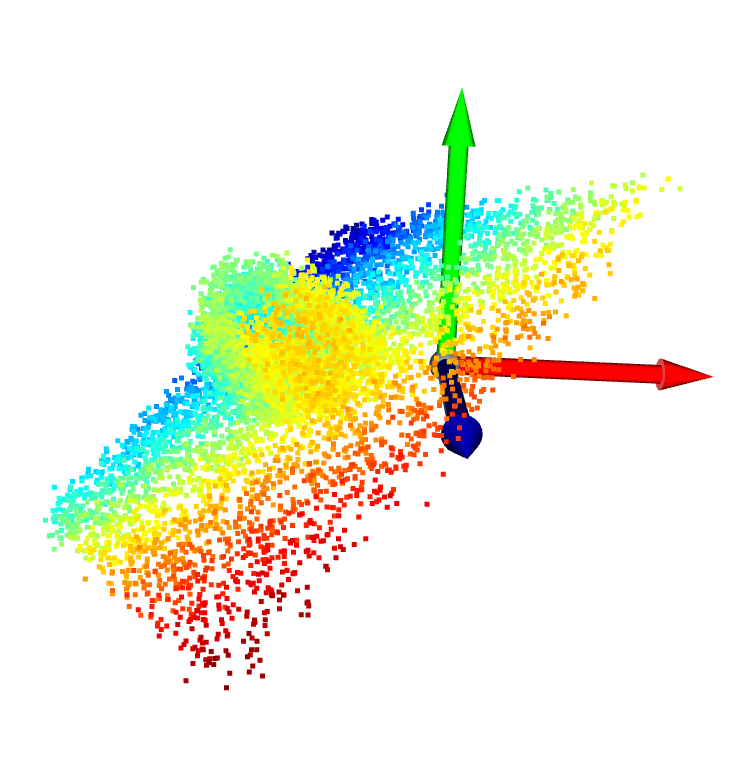
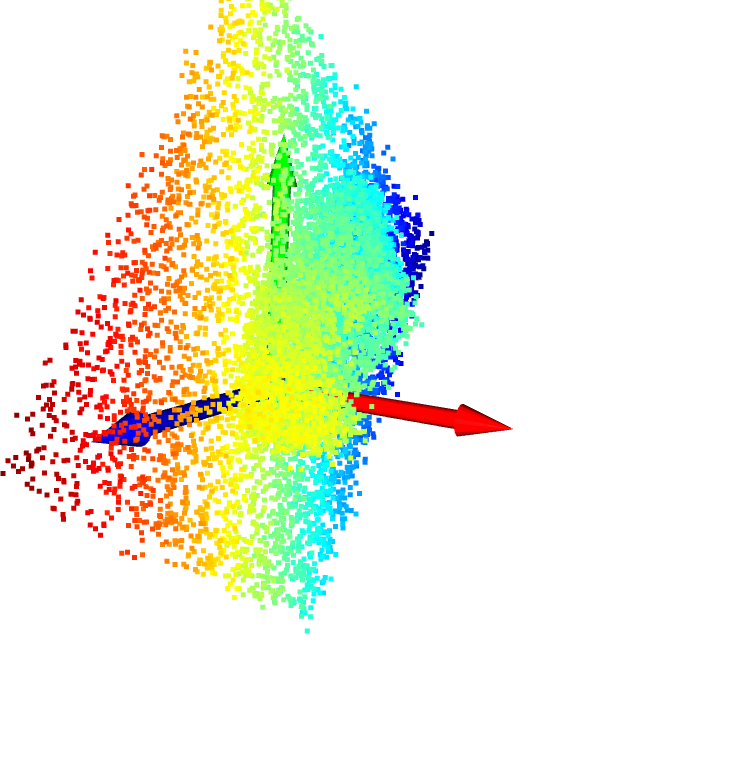
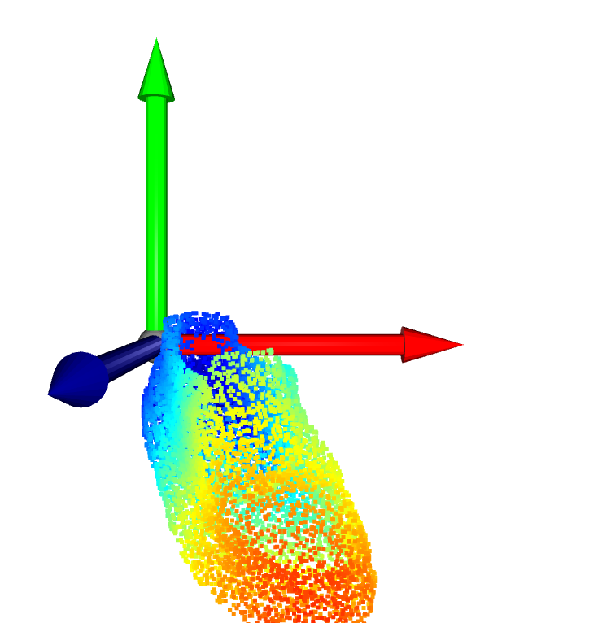
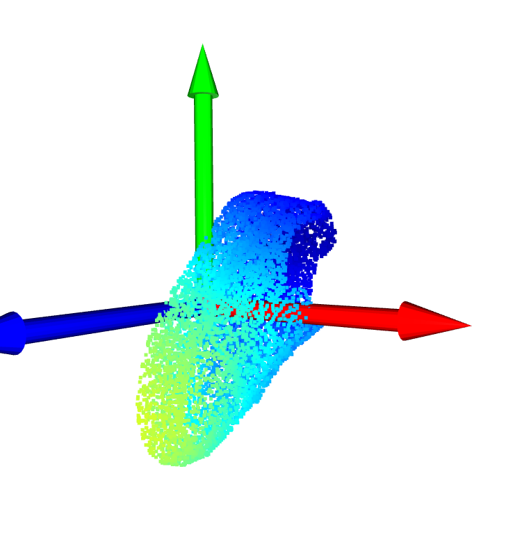
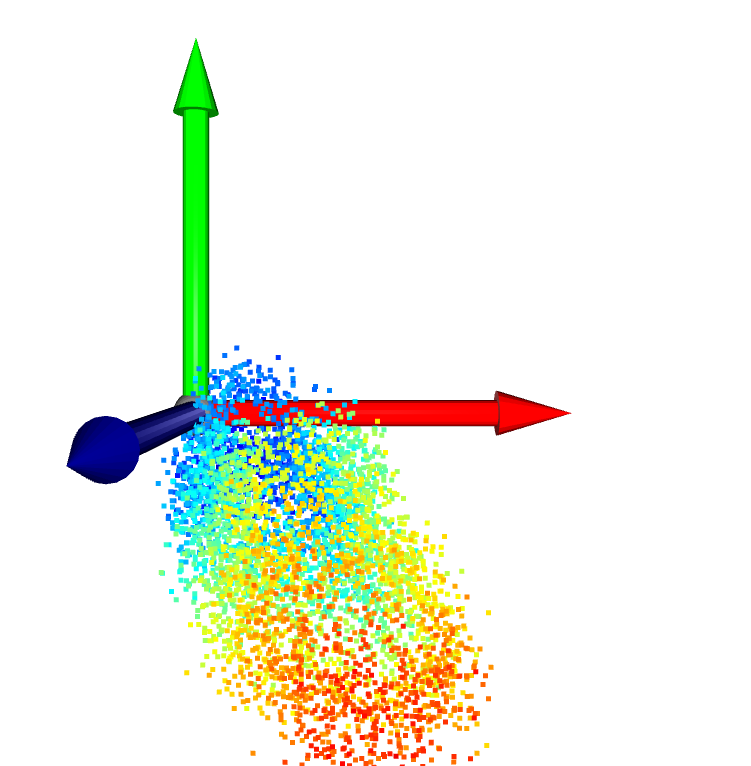
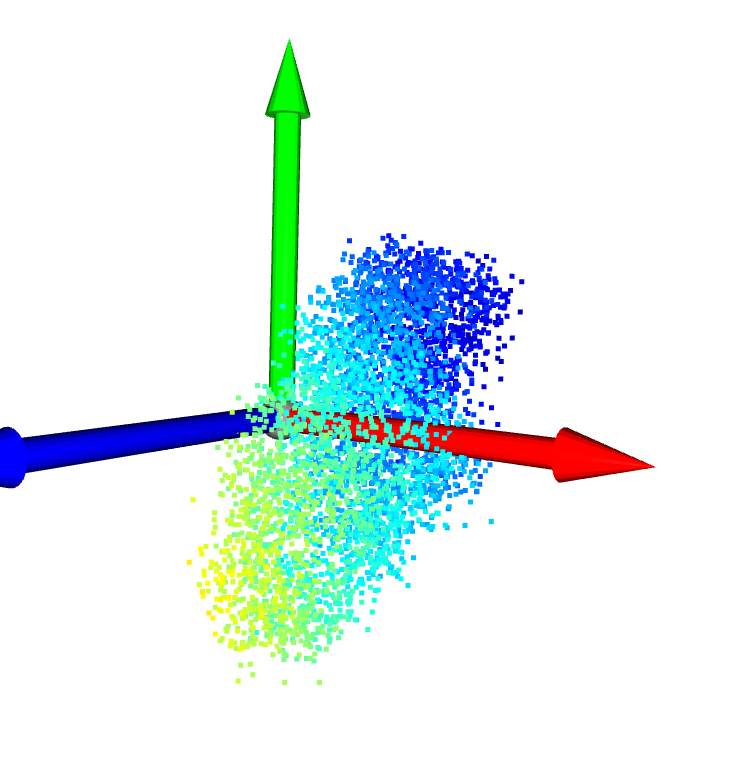
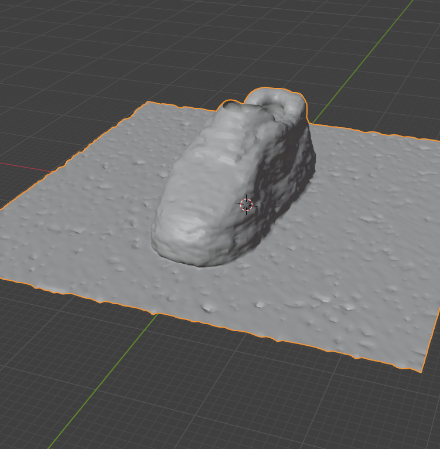

# Floor Detection using Principal Component Analysis (PCA)

This document explains the process of detecting a floor plane in a 3D point cloud of a shoe using PCA.

## Overview
#### reference python file: point-cloud-alignment.py

The `detect_floor_pca` function uses PCA to identify the floor plane in a 3D point cloud. It assumes that the floor is the largest planar structure in the scene and is roughly horizontal.

## Mathematical Intuition

- PCA finds the directions of maximum variance in the data.
- In a point cloud with a floor, the direction of least variance is typically perpendicular to the floor.
- This is because points on a flat floor have minimal variation in the up-down direction.

## Process

1. **Data Preparation**
   - Convert the point cloud to a numpy array.
   - Calculate the mean point of the cloud.
   - Center the points by subtracting the mean.

2. **Covariance Matrix Calculation**
   - Compute the covariance matrix of the centered points.
   - This matrix describes how the points vary in 3D space.

3. **Eigendecomposition**
   - Perform eigendecomposition on the covariance matrix.
   - This yields eigenvectors (principal directions) and eigenvalues (variances along these directions).

4. **Eigenvector Sorting**
   - Sort the eigenvectors based on their corresponding eigenvalues in descending order.
   - This orders the principal directions from most variance to least variance.

5. **Floor Normal Identification**
   - The eigenvector with the smallest eigenvalue is chosen as the floor normal.
   - This represents the direction of least variance, assumed to be perpendicular to the floor.

6. **Normal Direction Adjustment**
   - Determine the predominant orientation of the point cloud.
   - in the code example we have assumed that shoe always pointing to the upward direction. But if that is not the case we can use following approach to fix the issue.
   - If the majority of points are below the detected plane, keep the normal as-is.
   - If the majority of points are above the detected plane, then flip the normal.
   - This ensures the normal points towards the bulk of the point cloud data.

7. **Plane Equation Calculation**
   - Calculate the 'd' term in the plane equation ax + by + cz + d = 0.
   - This determines the distance of the plane from the origin.

8. **Result**
   - Return the floor normal vector and the 'd' term as a single array.

## Usage

The function returns a 4-element array:
- The first 3 elements represent the floor normal vector (a, b, c).
- The last element is the 'd' term in the plane equation.

This can be used to define the floor plane equation: ax + by + cz + d = 0

## Limitations

- Assumes the floor is the largest planar structure in the scene.
- May not work well if the floor is not the dominant plane or if the scene is very complex.
- Sensitive to outliers and non-floor planar structures.

## Changing Orientation to YZ Plane:
This function calculates a rotation that aligns the input `floor_normal` with the x-axis [1, 0, 0], creates a 4x4 transformation matrix from this rotation and translation (to shift to centre), applies it to the input point cloud. The result is a consistently oriented point cloud with the floor parallel to the **YZ plane** and at the centre.

## extras:
`add_noise_to_pcd` and  `reduce_pcd_size` functions were used to add some variation in the point cloud.

## Results:
#### X axis : red, Y axis: Green, Z axis : Blue
1. Shoe (with floor) in random orientation without any noise addition ( **19426 points sample**):

   

     
     
   

   *Left: Original randomly oriented point cloud. Right: After floor detection and alignment.*

2. Shoe (with floor) in random orientation with lesser points and added noise (**9713 points sample**):

   

     
     
   

   *Left: Original randomly oriented point cloud. Right: After floor detection and alignment.*

3. Shoe (without floor) in random orientation without any noise addition ( **9687 points sample**):

   

     
     
   

   *Left: Original randomly oriented point cloud. Right: After floor detection and alignment.*

4. Shoe (without floor) in random orientation with lesser points and added noise (**4843 points sample**):

   

     
     
   

   *Left: Original randomly oriented point cloud. Right: After floor detection and alignment.*
   
### Other Limitations:
This approach will require modifications and improvements depending upon the shoe geometry (**for example: Boot Shoes and Heels.**) 

# Point Cloud to other format conversions:  
Depending upon the use case we have different formats to represents to 3d geometry. 
1. **SDF (Signed Distance Function)**:
   - A SDF represents a surface implicitly by a function that returns the signed distance from any point to the nearest surface.
   - Positive values are outside the object, negative values are inside, and zero represents the surface.
   - SDFs are useful for efficient ray tracing, collision detection, and generating smooth surfaces.
   - Converting a point cloud to an SDF typically involves fitting a function to the points, often using machine learning techniques.

2. **MESH representation**:
   - A mesh is a collection of vertices, edges, and faces that define the shape of a 3D object.
   - It's the most complete representation for 3D geometry and is widely used in computer graphics and 3D modeling.
   - The Marching Cubes algorithm is a popular method to convert point clouds or volumetric data to mesh objects.
   - Refer to the attached file `mesh.py` which demonstrates converting a point cloud to a mesh object.
   

## Data Source
The point cloud data used in this project was sourced from [free3d.com] in obj format and later convert to point cloud format in blender via python scripting. 
